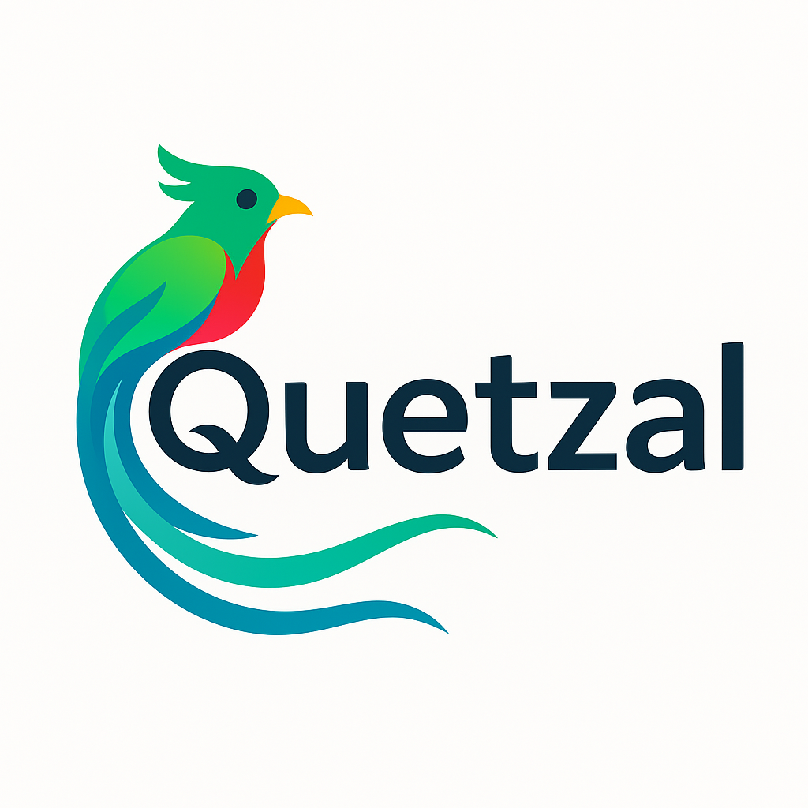

# Plan de Negocio - Plaza Comercial Quetzal

## 1. Resumen

### Resumen Ejecutivo

Plaza Comercial Quetzal es un innovador centro comercial y cultural ubicado en Teotihuacán de Arista, México, diseñado para celebrar y promover la rica herencia cultural de la región mientras satisface las necesidades contemporáneas de residentes y turistas. El proyecto fusiona tres elementos principales:

1. **Zona Gastronómica:** Un área dedicada a la comida típica mexicana, con énfasis en la cocina local y regional.
2. **Mercado de Artesanías:** Espacios comerciales para artesanos locales donde pueden exhibir y vender productos auténticos.
3. **Espacios de Coworking:** Áreas modernas de trabajo colaborativo que atienden tanto a profesionales locales como a nómadas digitales y turistas.

Quetzal busca posicionarse como un destino integral que combina tradición y modernidad, ofreciendo experiencias auténticas en un entorno inspirado en la cultura mesoamericana y adaptado a las tendencias actuales de consumo y trabajo.

### Análisis SWOT

**Fortalezas:**
- Ubicación estratégica en una zona turística de renombre internacional (Teotihuacán)
- Concepto híbrido único que atiende múltiples necesidades
- Diseño arquitectónico inspirado en la rica iconografía cultural local
- Enfoque en la autenticidad y sostenibilidad
- Marca visual distintiva y memorable (logo del quetzal)

**Debilidades:**
- Alta inversión inicial requerida
- Dependencia parcial del flujo turístico que puede ser estacional
- Complejidad en la gestión de múltiples líneas de negocio simultáneas
- Posible resistencia inicial de artesanos tradicionales al nuevo formato

**Oportunidades:**
- Creciente interés global en el turismo cultural y experiencial
- Aumento del trabajo remoto y nómadas digitales post-pandemia
- Revitalización económica de la región a través del emprendimiento local
- Posibilidad de crear alianzas con tour operadores y agencias turísticas
- Integración de tecnologías digitales para mejorar la experiencia del visitante

**Amenazas:**
- Competencia de otros centros comerciales y mercados artesanales tradicionales
- Fluctuaciones económicas que afecten el turismo nacional e internacional
- Cambios en las políticas públicas relacionadas con el patrimonio cultural
- Eventos imprevistos que puedan afectar el flujo turístico

### Modelo de Negocio

Plaza Comercial Quetzal opera bajo un modelo de múltiples fuentes de ingresos:

1. **Renta de espacios comerciales:** Locales para restaurantes, puestos de artesanías y otras tiendas temáticas.
2. **Membresías y renta de espacios de coworking:** Planes diarios, semanales y mensuales para emprendedores y profesionales.
3. **Eventos culturales y talleres:** Programación regular de actividades que generen ingresos adicionales.
4. **Porcentaje de ventas:** Comisión sobre las ventas realizadas por los comerciantes dentro de la plaza.
5. **Servicios adicionales:** Tours guiados, clases de cocina mexicana, experiencias culturales inmersivas.

### Análisis de Viabilidad

Basado en proyecciones preliminares, Plaza Comercial Quetzal tiene un potencial significativo de rentabilidad, con un período estimado de recuperación de inversión de 4-5 años. La diversificación de fuentes de ingresos reduce el riesgo y proporciona estabilidad financiera frente a fluctuaciones estacionales. La ubicación estratégica cerca de las pirámides de Teotihuacán garantiza un flujo constante de visitantes nacionales e internacionales.

## 2. Investigación de Mercado

### Panorama de la Industria

El turismo en México ha mostrado una tendencia de crecimiento sostenido, con especial énfasis en el turismo cultural. Teotihuacán recibe aproximadamente 4 millones de visitantes anuales, siendo uno de los sitios arqueológicos más visitados de México. Sin embargo, existe una oportunidad significativa para mejorar la oferta de servicios complementarios que extiendan la estadía de los turistas y mejoren su experiencia.

Paralelamente, el mercado de espacios de coworking ha experimentado un crecimiento exponencial a nivel global, acelerado por la pandemia y el aumento del trabajo remoto. México se ha posicionado como un destino preferido para nómadas digitales, creando una nueva demografía de visitantes que buscan combinar trabajo y experiencias culturales.

### Público Objetivo

Plaza Comercial Quetzal atiende a tres segmentos principales:

1. **Turistas nacionales e internacionales:** Visitantes de las zonas arqueológicas que buscan experiencias culturales auténticas, gastronomía local y artesanías de calidad.
2. **Residentes locales:** Habitantes de Teotihuacán y municipios cercanos que buscan espacios de socialización, entretenimiento y compras.
3. **Profesionales y emprendedores:** Personas que necesitan espacios de trabajo flexibles, incluyendo nómadas digitales que combinan trabajo y turismo.

### Tamaño y Tendencias del Mercado

El turismo en la zona arqueológica de Teotihuacán representa un mercado potencial de:
- 4 millones de visitantes anuales
- Gasto promedio por turista: $800-1,200 MXN por día
- Estancia promedio actual: 1 día (oportunidad para extender)

El mercado de espacios de coworking en México:
- Crecimiento anual del 20% en los últimos 5 años
- Aumento del 35% en la demanda de espacios flexibles fuera de grandes centros urbanos
- Tendencia creciente de "workations" (trabajo + vacaciones)

### Análisis de Competidores

**Competencia directa:**
- Mercados artesanales tradicionales en la zona
- Restaurantes independientes cerca de la zona arqueológica
- Espacios de coworking en San Juan Teotihuacán y municipios cercanos

**Competencia indirecta:**
- Centros comerciales modernos en municipios cercanos
- Experiencias turísticas alternativas en la región
- Plataformas digitales de venta de artesanías

**Ventaja competitiva de Quetzal:**
La integración de gastronomía, artesanías y espacios de trabajo en un solo destino con diseño inspirado en la cultura local crea una propuesta de valor única que no existe actualmente en la región.

## 3. Productos y Servicios

### Ofertas Principales

**Zona Gastronómica:**
- 12-15 restaurantes y puestos de comida típica mexicana
- Enfoque en ingredientes locales y recetas tradicionales
- Desde cocina prehispánica hasta fusiones contemporáneas
- Área central compartida de mesas con diseño inspirado en patios mesoamericanos

**Mercado de Artesanías:**
- 25-30 locales para artesanos locales y regionales
- Curaduría de productos para garantizar autenticidad y calidad
- Énfasis en técnicas tradicionales y materiales sostenibles
- Espacios para demostraciones en vivo de técnicas artesanales

**Espacios de Coworking:**
- 50 estaciones de trabajo individuales
- 5 salas de reuniones de diversos tamaños
- Áreas comunes de descanso y networking
- Internet de alta velocidad y servicios tecnológicos
- Vistas panorámicas al entorno natural y arquitectónico de Teotihuacán

### Oportunidades de Expansión

- Programas educativos y talleres culturales regulares
- Residencias artísticas para creadores nacionales e internacionales
- Desarrollo de línea de productos exclusivos bajo la marca Quetzal
- Plataforma digital para venta de artesanías en línea
- Experiencias virtuales de la cultura teotihuacana

## 4. Ventas y Marketing

### Resumen de Marketing

La estrategia de marketing de Plaza Comercial Quetzal se enfoca en posicionar el proyecto como un destino imprescindible que complementa la visita a las pirámides, ofreciendo experiencias auténticas y memorables. La comunicación destacará:

- La fusión única de tradición cultural y modernidad
- La autenticidad de las experiencias gastronómicas y artesanales
- La funcionalidad de los espacios de coworking en un entorno inspirador
- El compromiso con la comunidad local y la sostenibilidad

### Branding e Identidad

El nombre "Quetzal" evoca la majestuosidad de una de las aves más emblemáticas de Mesoamérica, símbolo de libertad y belleza. El logo presenta un quetzal estilizado en tonos verdes, azules y rojos, combinando elementos tradicionales con un diseño contemporáneo.

La paleta de colores incluye:
- Verde esmeralda (representando la naturaleza y el plumaje del quetzal)
- Azul turquesa (evocando el color asociado a deidades mesoamericanas)
- Rojo carmín (símbolo de vida y energía en la cosmovisión prehispánica)
- Negro obsidiana (elemento de contraste y referencia a materiales tradicionales)

La identidad visual se aplicará consistentemente en:
- Señalización interna y externa
- Material promocional
- Plataformas digitales
- Uniformes del personal
- Packaging y productos promocionales

### Retención de Clientes

- Programa de lealtad "Plumas de Quetzal" con beneficios para visitantes frecuentes
- Eventos exclusivos para miembros
- Descuentos cruzados entre las diferentes áreas de la plaza
- Newsletter mensual con calendario de actividades y promociones especiales
- Encuestas de satisfacción y sistema de feedback continuo

### Presencia en Línea

- Sitio web responsivo con información detallada de todos los servicios
- Reservas en línea para restaurantes y espacios de coworking
- Directorio virtual de artesanos con historias personales
- Blog sobre cultura, gastronomía y arte local
- Integración con plataformas de viajes y experiencias

### Redes Sociales

- Instagram: Contenido visual enfocado en la estética, gastronomía y artesanías
- Facebook: Comunidad e información de eventos y promociones
- TikTok: Experiencias inmersivas y contenido viral sobre cultura
- Pinterest: Inspiración sobre diseño, artesanías y gastronomía mexicana
- YouTube: Documentación de procesos artesanales y recetas tradicionales

### SEO y Contenido

- Estrategia de palabras clave enfocada en turismo cultural, Teotihuacán y experiencias auténticas
- Contenido optimizado en múltiples idiomas (español, inglés, francés)
- Colaboraciones con creadores de contenido especializados en viajes y cultura
- Guías descargables sobre la región y su patrimonio cultural

### Marketing Digital

- Campañas segmentadas en plataformas de viaje (TripAdvisor, Expedia)
- Publicidad geolocalizada para visitantes de la zona arqueológica
- Colaboraciones con influencers especializados en viajes, gastronomía y cultura
- Marketing por email personalizado según intereses y comportamiento previo

### Participación de la Comunidad

- Programa de embajadores locales que promuevan la plaza
- Alianzas con escuelas y universidades para visitas educativas
- Espacios gratuitos periódicos para artistas y artesanos emergentes
- Eventos benéficos para apoyar causas locales

## 5. Finanzas

### Ingresos

**Proyección de ingresos anuales (5 años):**

| Fuente de Ingreso | Año 1 | Año 2 | Año 3 | Año 4 | Año 5 |
|-------------------|-------|-------|-------|-------|-------|
| Renta de locales comerciales | $3.6M | $4.2M | $4.6M | $5.0M | $5.4M |
| Membresías coworking | $1.8M | $2.5M | $3.2M | $3.8M | $4.2M |
| Comisiones por ventas | $1.2M | $1.6M | $2.0M | $2.4M | $2.8M |
| Eventos y talleres | $0.8M | $1.2M | $1.5M | $1.8M | $2.2M |
| Servicios adicionales | $0.6M | $0.9M | $1.2M | $1.5M | $1.8M |
| **Total** | **$8.0M** | **$10.4M** | **$12.5M** | **$14.5M** | **$16.4M** |

*Cifras en pesos mexicanos (millones)*

### Gastos

**Gastos operativos anuales:**

| Categoría | Año 1 | Año 2 | Año 3 | Año 4 | Año 5 |
|-----------|-------|-------|-------|-------|-------|
| Nómina | $2.2M | $2.4M | $2.6M | $2.8M | $3.0M |
| Mantenimiento | $1.0M | $1.1M | $1.2M | $1.3M | $1.4M |
| Servicios (luz, agua, etc.) | $0.8M | $0.9M | $1.0M | $1.1M | $1.2M |
| Marketing | $1.2M | $1.0M | $0.9M | $0.8M | $0.8M |
| Seguros | $0.3M | $0.3M | $0.3M | $0.4M | $0.4M |
| Impuestos | $1.0M | $1.4M | $1.7M | $2.0M | $2.3M |
| Otros | $0.5M | $0.6M | $0.6M | $0.7M | $0.7M |
| **Total** | **$7.0M** | **$7.7M** | **$8.3M** | **$9.1M** | **$9.8M** |

*Cifras en pesos mexicanos (millones)*

### Financiamiento

**Estructura de inversión inicial: $22M MXN**

- Inversión de socios fundadores: 35% ($7.7M)
- Préstamo bancario: 45% ($9.9M)
- Inversores privados: 20% ($4.4M)

**Términos del préstamo bancario:**
- Monto: $9.9M MXN
- Tasa de interés: 12% anual
- Plazo: 8 años
- Pago mensual: $153,000 MXN aproximadamente

### Dividendos

La política de dividendos contempla:
- Primeros 2 años: Reinversión total de utilidades
- Año 3: Distribución del 20% de utilidades
- Año 4: Distribución del 30% de utilidades
- Año 5 en adelante: 40-50% de utilidades según desempeño

### Impuestos

Consideraciones fiscales principales:
- ISR (Impuesto Sobre la Renta): 30%
- IVA (Impuesto al Valor Agregado): 16%
- Impuesto predial y derechos municipales
- Incentivos fiscales por promoción cultural y turística

### Pérdidas y Ganancias

**Estado de resultados proyectado:**

| Concepto | Año 1 | Año 2 | Año 3 | Año 4 | Año 5 |
|----------|-------|-------|-------|-------|-------|
| Ingresos | $8.0M | $10.4M | $12.5M | $14.5M | $16.4M |
| Gastos operativos | $7.0M | $7.7M | $8.3M | $9.1M | $9.8M |
| EBITDA | $1.0M | $2.7M | $4.2M | $5.4M | $6.6M |
| Depreciación | $0.5M | $0.5M | $0.5M | $0.5M | $0.5M |
| Intereses | $1.1M | $1.0M | $0.9M | $0.7M | $0.6M |
| Utilidad antes de impuestos | -$0.6M | $1.2M | $2.8M | $4.2M | $5.5M |
| Impuestos | $0.0M | $0.4M | $0.8M | $1.3M | $1.7M |
| **Utilidad neta** | **-$0.6M** | **$0.8M** | **$2.0M** | **$2.9M** | **$3.8M** |

*Cifras en pesos mexicanos (millones)*

### Hoja de Balance

**Proyección al final del primer año:**

**Activos:**
- Activo circulante: $1.5M
- Activo fijo (terreno y edificio): $18M
- Otros activos: $2M
- **Total activos:** $21.5M

**Pasivos:**
- Pasivo circulante: $1.2M
- Deuda a largo plazo: $9.1M
- **Total pasivos:** $10.3M

**Capital:**
- Capital social: $12M
- Utilidades retenidas: -$0.8M
- **Total capital:** $11.2M

### Flujo de Efectivo

**Proyección de flujo de efectivo primer año (trimestral):**

| Concepto | Q1 | Q2 | Q3 | Q4 | Total |
|----------|-----|-----|-----|-----|-------|
| Saldo inicial | $3.0M | $1.8M | $1.2M | $1.0M | $3.0M |
| Ingresos operativos | $1.2M | $1.8M | $2.3M | $2.7M | $8.0M |
| Gastos operativos | -$1.9M | -$1.8M | -$1.7M | -$1.6M | -$7.0M |
| Pago de préstamos | -$0.5M | -$0.5M | -$0.5M | -$0.5M | -$2.0M |
| Otros | $0.0M | -$0.1M | -$0.3M | -$0.2M | -$0.6M |
| **Saldo final** | **$1.8M** | **$1.2M** | **$1.0M** | **$1.4M** | **$1.4M** |

*Cifras en pesos mexicanos (millones)*

### Plan de Financiamiento

**Requisitos de capital adicional:**
- Línea de crédito revolvente: $2M MXN para necesidades de liquidez
- Reserva de contingencia: $1M MXN para imprevistos
- Capital de inversión para expansiones futuras (Año 3): $5M MXN

**Estrategia de salida:**
- Venta a inversionista estratégico
- Adquisición por cadena de centros comerciales
- Compra de acciones por la administración

## 6. Operaciones

### Equipo y Roles

**Estructura organizacional:**

- **Dirección General:** Supervisión integral del proyecto
- **Gerencia Comercial:** Gestión de rentas y relaciones con locatarios
- **Gerencia de Coworking:** Administración de espacios de trabajo
- **Gerencia de Eventos y Cultura:** Programación de actividades
- **Gerencia de Marketing:** Promoción y comunicación
- **Administración y Finanzas:** Contabilidad y gestión financiera
- **Operaciones y Mantenimiento:** Cuidado de instalaciones

**Personal de tiempo completo (inicial):**
- 15 empleados administrativos
- 8 empleados de mantenimiento y seguridad
- 5 empleados de atención al cliente

### Plan de Operaciones

**Horarios:**
- Zona gastronómica: 8:00 AM - 10:00 PM
- Mercado de artesanías: 10:00 AM - 8:00 PM
- Espacios de coworking: 7:00 AM - 11:00 PM (acceso 24/7 para miembros premium)

**Procesos clave:**
- Selección y rotación de artesanos expositores
- Control de calidad gastronómica
- Mantenimiento preventivo de instalaciones
- Gestión de reservas y membresías
- Seguridad y protección civil

**Tecnología:**
- Sistema centralizado de gestión de inmuebles
- Plataforma de reservas en línea
- Control de acceso digital para espacios de coworking
- Wi-Fi de alta velocidad en todas las áreas
- Sistema de punto de venta integrado para comerciantes

### Análisis de Riesgos

**Principales riesgos identificados:**

1. **Fluctuaciones en el turismo:**
   - Mitigación: Diversificación de público objetivo incluyendo residentes locales

2. **Competencia creciente:**
   - Mitigación: Diferenciación constante y fortalecimiento de la propuesta de valor única

3. **Cambios regulatorios:**
   - Mitigación: Asesoría legal permanente y relaciones proactivas con autoridades

4. **Riesgos operativos:**
   - Mitigación: Seguros comprensivos y planes de contingencia detallados

5. **Riesgos financieros:**
   - Mitigación: Monitoreo constante de indicadores clave y reservas de contingencia

### Cumplimiento Normativo

**Permisos y licencias necesarios:**
- Licencia municipal de funcionamiento
- Permisos de uso de suelo comercial
- Licencia de construcción y remodelación
- Registros sanitarios para establecimientos de alimentos
- Cumplimiento normativo en materia de patrimonio cultural (debido a la ubicación)

**Certificaciones a obtener:**
- Certificado de Calidad Turística (SECTUR)
- Certificación ambiental (Programa Nacional de Auditoría Ambiental)
- Distintivo H (manejo higiénico de alimentos)
- Certificación en accesibilidad universal

## 7. Plan de Implementación

### Pre-lanzamiento

**Fase 1: Planificación y diseño (6 meses)**
- Finalización de planos arquitectónicos
- Obtención de permisos y licencias
- Desarrollo de plan detallado de marketing
- Reclutamiento de personal clave

**Fase 2: Construcción y acondicionamiento (12 meses)**
- Construcción de edificaciones principales
- Instalación de servicios básicos
- Acondicionamiento de espacios comerciales
- Instalación de equipamiento tecnológico

**Fase 3: Comercialización y pre-apertura (3 meses)**
- Selección de primeros inquilinos
- Capacitación de personal
- Campaña de expectativa en medios
- Eventos exclusivos para medios y socios clave

### Post-lanzamiento

**Primer trimestre:**
- Monitoreo intensivo de operaciones
- Ajustes en base a feedback inicial
- Incremento gradual de ocupación comercial
- Primeros eventos culturales de alto impacto

**Primer año:**
- Consolidación de marca y posicionamiento
- Evaluación trimestral de KPIs operativos y financieros
- Implementación de programa de mejora continua
- Expansión de red de alianzas estratégicas

### Plan de 5 Años

**Año 1-2: Establecimiento**
- Alcanzar 85% de ocupación comercial
- Establecer programa regular de eventos culturales
- Lograr punto de equilibrio financiero
- Consolidar base de clientes frecuentes

**Año 3: Crecimiento**
- Implementar primera fase de expansión física
- Desarrollar línea de productos marca propia
- Lanzar plataforma de comercio electrónico
- Iniciar programa de franquicias para concepto gastronómico

**Año 4-5: Consolidación y expansión**
- Evaluar posibilidades de replicar el modelo en otros destinos turísticos
- Desarrollar programa de intercambio cultural internacional
- Implementar tecnologías avanzadas de experiencia del cliente
- Consolidar Quetzal como referente de integración cultural y comercial sostenible
